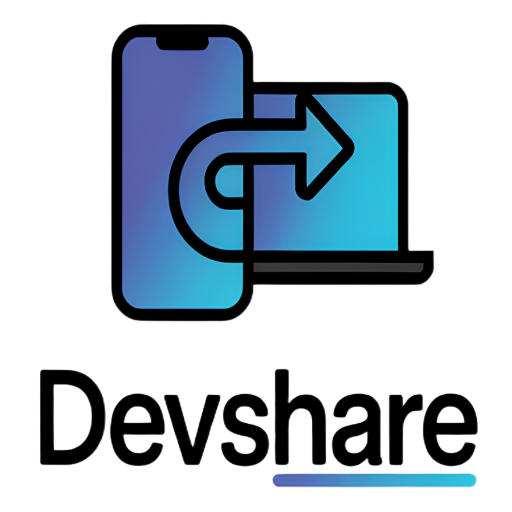
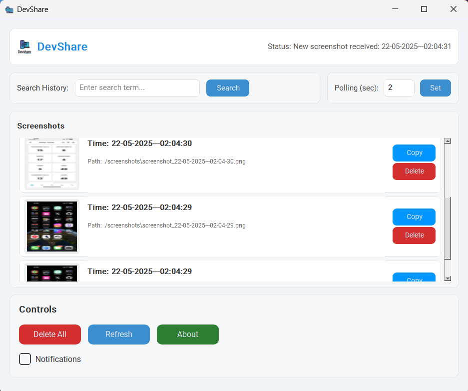

<p align="center">
  <a href="https://github.com/Rkcr7/DevShare">
    
  </a>
</p>

<h1 align="center">
  <a href="https://github.com/Rkcr7/DevShare">DevShare</a>
</h1>

<p align="center">
  <a href="#features">Features</a> •
  <a href="#use-cases">Use Cases</a> •
  <a href="#getting-started">Getting Started</a> •
  <a href="#installation">Installation</a> •
  <a href="#usage">Usage</a> •
  <a href="#troubleshooting">Troubleshooting</a>
</p>

<p align="center">
  <a href="https://github.com/Rkcr7/DevShare">
    
  </a>
  <a href="https://github.com/Rkcr7/DevShare">
    
  </a>
  <a href="https://github.com/Rkcr7/DevShare/blob/main/LICENSE">
    
  </a>
  <a href="https://github.com/Rkcr7">
    
  </a>
</p>

## 📸 Overview

DevShare is a cross-platform productivity tool that seamlessly transfers screenshots from your phone to your computer with zero friction. It automatically copies received screenshots to your clipboard, making them instantly available for pasting in any application.

<p align="center">
  
</p>

## 🚀 Features

- **Phone-to-PC Sync**: Instantly transfer screenshots from your mobile to your computer
- **Automatic Clipboard**: Screenshots are automatically available for pasting anywhere
- **User-Friendly Interface**: Modern UI with intuitive controls and search functionality
- **Cross-Platform**: Works on Windows, macOS, and Linux
- **Cloud Sync**: Uses a cloud service to reliably transfer screenshots
- **History Management**: Browse, search, and manage all your screenshot history
- **One-Click Copy**: Re-copy any historical screenshot with a single click
- **Smart De-duplication**: Automatically detects and handles duplicate screenshots
- **Customizable Settings**: Adjust polling intervals and notification preferences
- **Secure**: Authentication ensures only you can send screenshots to your PC

## 💡 Use Cases

### Web & Mobile Development
Never struggle with sharing mobile app screenshots during development again:
1. Encounter a UI issue in your mobile app? Take a screenshot
2. Send it to your bot
3. It appears in your PC's clipboard - paste directly into Slack, JIRA, or your IDE

### AI & Development with Cursor
Streamline your workflow with Cursor.sh and other AI coding assistants:
1. Capture something on your phone screen (error, design, code)
2. Screenshot appears instantly on your clipboard
3. Paste directly into Cursor's AI chat for analysis or debugging
4. No more emailing yourself screenshots or using file transfer apps!

### Design Reviews
Perfect for designers collaborating remotely:
1. Capture design inspirations on your phone
2. Instantly available on your PC for discussions
3. No interruption to your creative flow

### Remote Troubleshooting
Help friends and family with tech issues:
1. Have them take screenshots of error messages
2. Receive them instantly on your machine
3. Provide solutions without the frustration of explaining "how to send a screenshot"

### Research & Documentation
Gather visual data efficiently:
1. Capture research materials on your phone while reading
2. Automatically organize into your project workflow
3. Search through your screenshot history to find specific references

## 📋 Prerequisites

- Python 3.6 or higher
- A Telegram account and the Telegram app on your phone
- Internet connection on both your phone and PC

## 🔑 Getting Started

Before installing DevShare, you'll need your Telegram ID to authenticate with the service:

1. Open Telegram on your phone or desktop
2. Search for the bot named **@userinfobot**
3. Start a chat and send any message
4. The bot will reply with your Telegram User ID (a number like `123456789`)
5. Note this number as you'll need it during setup

Once installed, you'll use the official DevShare bot:
- Search for **@Screenshot_rk7_bot** in Telegram
- Or visit directly: [t.me/Screenshot_rk7_bot](https://t.me/Screenshot_rk7_bot)
- Only your authorized device will receive the screenshots you send to this bot

## 🔧 Installation

### Windows
```bash
# 1. Clone the repository
git clone https://github.com/Rkcr7/DevShare.git
cd DevShare

# 2. Run the setup script
setup.bat

# 3. Launch the application
run_devshare.bat
```

### Linux/macOS
```bash
# 1. Clone the repository
git clone https://github.com/Rkcr7/DevShare.git
cd DevShare

# 2. Make scripts executable
chmod +x setup.sh run_devshare.sh

# 3. Run the setup script
./setup.sh

# 4. Launch the application
./run_devshare.sh
```

### Manual Installation
If the setup scripts don't work for you:

```bash
# Install dependencies
pip install -r requirements.txt

# Linux users: Install clipboard utility
sudo apt-get install xclip   # Debian/Ubuntu
# or
sudo dnf install xclip       # Fedora

# Run the application
python main.py
```

If the setup wizard doesn't appear or you need to manually configure the application:

1. Create a `config.json` file in the root directory with the following structure:
```json
{
  "telegram_id": "YOUR_TELEGRAM_ID",
  "service_url": "https://devshare-production.up.railway.app"
}
```

2. Replace `YOUR_TELEGRAM_ID` with your actual Telegram ID (numeric value)
   - To find your ID, message @userinfobot on Telegram

3. The `service_url` is pre-configured to the cloud server - typically you won't need to change this value

4. After creating the file, run the application using `python main.py`

## 📱 Usage

1. Start the application using the appropriate launcher for your platform
2. Open Telegram on your phone and search for **@Screenshot_rk7_bot** 
   - Or visit directly: [t.me/Screenshot_rk7_bot](https://t.me/Screenshot_rk7_bot)
3. Send `/start` to initialize the bot
4. Take a screenshot on your phone and send it to the bot
5. The screenshot will be automatically copied to your PC's clipboard - just paste anywhere!
6. Use the application interface to browse, search, and manage your screenshot history

## ⚠️ Troubleshooting

- **Bot Doesn't Respond**: Ensure your internet connection is active and the application is running
- **Clipboard Issues**: 
  - Windows: Verify pywin32 is installed (`pip install pywin32`)
  - Linux: Ensure xclip is installed (`sudo apt-get install xclip`)
  - macOS: No additional setup needed
- **UI Issues**: Make sure customtkinter is installed correctly (`pip install customtkinter==5.2.0`)
- **Connection Problems**: Verify your internet connection and that the service is available

## 📝 License

This project is licensed under the MIT License - see the LICENSE file for details.

## 👨‍💻 Developer

Developed by [Ritik](https://github.com/Rkcr7) to streamline the screenshot sharing workflow between devices.

### Repository
- **GitHub Repository**: [github.com/Rkcr7/DevShare](https://github.com/Rkcr7/DevShare)
- **Clone URL**: `https://github.com/Rkcr7/DevShare.git`
- **Report Issues**: [github.com/Rkcr7/DevShare/issues](https://github.com/Rkcr7/DevShare/issues)

### Contact
- **Email**: [ritik135001@gmail.com](mailto:ritik135001@gmail.com)
- If you have questions, bug reports, or feature requests, feel free to reach out via email or create an issue on GitHub

## 🙏 Acknowledgements

- [Python Telegram Bot](https://github.com/python-telegram-bot/python-telegram-bot) for the Telegram integration
- [CustomTkinter](https://github.com/TomSchimansky/CustomTkinter) for the modern UI components
- All contributors and users who provide feedback and suggestions 